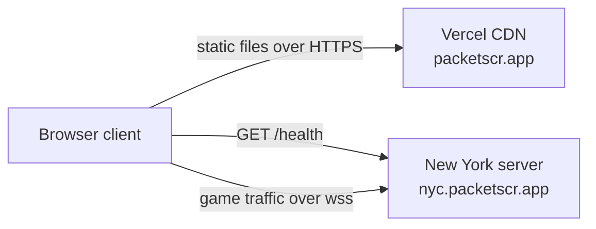

# Architecture

Design specification; E0 implements only a transport room and local connection harness. Game state, actions, and deployment are not implemented. The diagram shows the planned production topology. Development runs the client and one server together on the Atlanta host, as described in [DEPLOYMENT.md](DEPLOYMENT.md).

## Components

Production starts with one region. Further regions join the client's region list and receive the same health checks; see [REGIONS_AND_HEALTH.md](REGIONS_AND_HEALTH.md).

- **The client** is static files. It draws the game, reads the keyboard, and sends actions.
- **Each game server** is one Node process running Colyseus. It holds every match on that server in memory.
- **Servers do not talk to each other.** Each region is independent.

**Why no central matchmaker:** a matchmaking service would be one more thing to host and one more thing that can fail. The client picks a region from a list shipped in its own bundle, so a region going down never takes the others with it.

## Authority

The server owns the game state. Clients send what they want to do, and the server decides what happens.

- A client never sends a position, a health value, or a scrap total.
- The server owns the clock, so phase changes and cooldowns cannot be sped up from a browser.
- The client draws what the server reports.

**Why:** the code is public, so a cheater can read and modify the client freely. When the client has no say in the outcome, the server can reject illegal actions; automation and other abuse still require explicit limits.

## Tick loop

The server advances every match 15 times a second. Each tick runs in this order:

1. Apply queued player and bot actions, at most one of each kind per player.
2. Move ships.
3. Resolve blaster and turret fire.
4. Apply damage, deaths, scrap drops, and pickups.
5. Advance timers: respawns, phase changes, the sudden-death Belt.
6. Send each client the state changes it is allowed to see.

The step logic is a set of pure functions in `shared/`. The Colyseus room calls them and holds the result.

**Why 15 ticks per second:** on a grid, actions resolve on whole ticks, so a higher rate adds traffic without making the game feel faster. Fifteen keeps the delay between a key press and its result under about 70 milliseconds before network latency.

**Why the client interpolates:** drawing a ship sliding between its last two reported tiles makes movement look smooth, with no prediction code and no corrections when the server disagrees.

## Room lifecycle

| State | Entered when | Leaves when |
|---|---|---|
| `waiting` | The room is created | Quick Play: the countdown ends or 5 players join. Private: the host starts it. |
| `build` | The match starts | 120 s pass |
| `battle` | The Belt drops | 300 s pass or one player remains |
| `sudden_death` | 300 s pass | One player remains |
| `ended` | A winner or draw is decided | Results have been shown for a few seconds, then the room is disposed |

- A room locks when it leaves `waiting`. After that it accepts only reconnecting players and spectators.
- A room in `waiting` with no players is disposed.

## State and visibility

State is defined with Colyseus schemas. The main pieces are match info (phase, clock), players, ships, cores, structures, deposits, and scrap pickups.

Visibility follows one rule per phase:

| Phase | Players receive | Spectators receive |
|---|---|---|
| `waiting` | The player list | Nothing |
| `build` | Match info, plus everything in their own sector | Match info only |
| `battle` and later | Everything | Everything |

This uses Colyseus per-client state views. Each player's view holds their own sector during the build phase, and everything is added to every view when the Belt drops.

**Why filter on the server:** anything sent to a browser can be read in its developer tools. If enemy bases were sent and merely not drawn, hiding them would be cosmetic.

**Why sector-level filtering:** it changes once per match. Per-tick line-of-sight filtering would add work on every tick for every player, and Colyseus advises against leaning on state views for large, fast-changing sets.

## Messages

Clients send five message types.

| Message | Payload | Server checks |
|---|---|---|
| `move` | A direction, or none to stop | The ship is alive and the target tile is passable for this player |
| `fire` | None | The ship is alive and the cooldown has passed |
| `build` | `wall` or `turret` | The ship is alive, the tile is free and within the build radius, and the player can afford it |
| `upgrade` | `blaster` or `hull` | The level is below the maximum and the player can afford it |
| `start` | None | The room is private and waiting, the sender is the host, and at least two participants are present |

Anything else, or anything malformed, is dropped.

## Abuse limits

| Limit | Starting value | Why |
|---|---|---|
| Actions per client | 30 per second | The game cannot use more than a few per tick. Excess is dropped, and sustained flooding disconnects the client. |
| Connections per IP address | 20 | Stops one machine from filling a server. The limit is generous because players on the same campus or home network share one public address. |
| Allowed origins | Exact client origin for the environment; localhost only in local mode | Stops other websites from embedding the game against these servers. It does not stop custom clients, which is why the server validates everything. |
| Rooms per server | `MAX_ROOMS`, starting at 20 | Protects the 512 MB droplet. When the limit is reached, the server reports that it is not accepting players. |
| Nickname | 1 to 16 characters, trimmed, control characters removed | Nicknames are shown to other players, so they are treated as untrusted input. |

Automation cannot be prevented: a script can play legal moves. The tick rate limits how much speed helps, and that is the accepted level of protection for this project.

## Reconnection

- When a connection drops, the server holds the player's seat for 20 seconds.
- The ship stays in the world and can be attacked during that time.
- The client keeps its reconnection token in `sessionStorage` and rejoins the same room automatically.
- If the 20 seconds pass, the ship is removed, and the core stays as a target.

**Why the ship stays in the world:** if disconnecting made a ship vanish, pulling the network cable would be a way to dodge a fight.

## The bot

The bot runs inside the room. Each tick it reads the same state a player in its seat would see and queues the same actions a client would send. It goes through the same validation as a human.

**Why it shares the action path:** the bot can never do something a human cannot, and every bot match also exercises the real rules.

## Version compatibility

`shared/` exports a `PROTOCOL_VERSION` number. It increases whenever messages or state change in a way an old client could not handle.

- Each server reports its protocol version, environment, and full build SHA from `/health`.
- The client ignores any region whose version differs from its own.

**Why:** the client and the servers deploy separately and at slightly different times. Without the check, a player could join a server running different rules and see a broken game.

## What the server does not do

- It does not store anything on disk.
- It does not share state between regions.
- It does not move a match when a server stops. Players in that match return to the start page, where region selection runs again.

## Operational boundaries

Development and production have separate region allowlists and never fail over across environments. Validate configuration at startup. Deployments must coordinate draining, protocol compatibility, client promotion, and rollback as specified in [DEPLOYMENT.md](DEPLOYMENT.md). Test capacity before raising room limits; monitor runtime metrics privately under [OPERATIONS.md](OPERATIONS.md).
